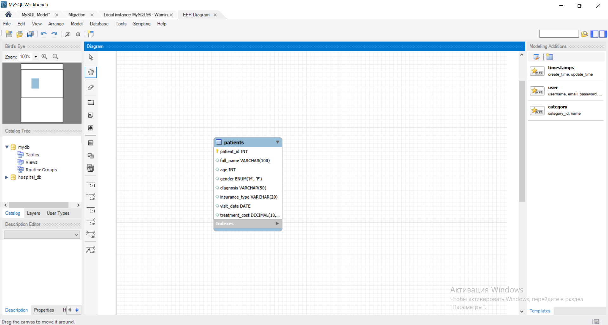

# 🏥 Medical Center Data Analysis (SQL)

### Project Overview
As a former medical professional transitioning into IT, I developed this project to demonstrate how SQL can optimize healthcare data management. I designed a database schema and performed data analysis to find insights into treatment costs and patient demographics.

### Key Skills Demonstrated:
* **Database Design:** Created a structured schema for patient records.
* **Data Aggregation:** Used `GROUP BY` and `AVG` to calculate costs per diagnosis.
* **Filtering & Logic:** Applied complex `WHERE` clauses to identify high-risk patient groups.

### Analytical Questions Answered:
1. What is the average cost of treatment for each diagnosis?
2. What is the revenue distribution by insurance type?
3. Which age groups are most frequently diagnosed with chronic conditions?

### Project Visuals

